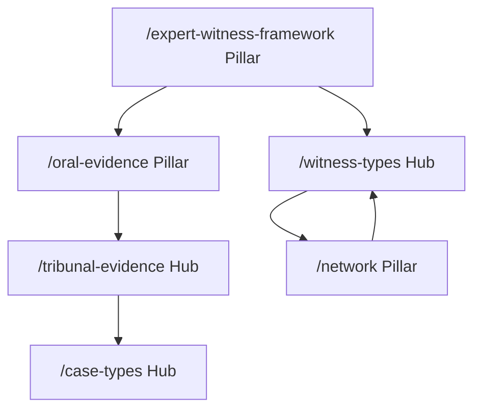
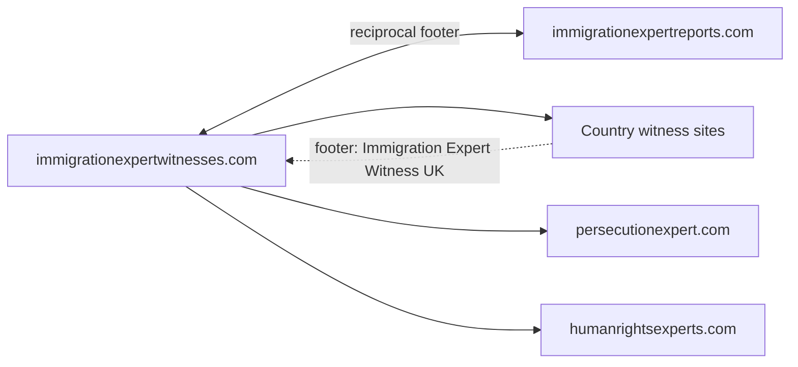

# SEO Architecture — immigrationexpertwitnesses.com

**Canonical domain:** `https://www.immigrationexpertwitnesses.com`  
**Site name:** Immigration Expert Witnesses  
**Locale:** `en_GB` (UK immigration solicitors, tribunal practitioners, Legal Aid)  
**Role:** Witness master hub (network directory + CPR Part 35 / oral evidence / witness taxonomy)

This document is the single source of truth for keyword strategy, unique content assets, content clusters, GEO (Generative Engine Optimization), network positioning, off-page SEO, internal linking, and launch deployment for immigrationexpertwitnesses.com. All slugs and URLs align with the canonical SEO brief naming convention.

**Implementation status:** Target architecture (June 2026). Greenfield repo — no routes implemented yet. Run `npm run seo:generate && npm run seo:verify` after content or route changes.

---

## 1. Keyword Strategy

### Tier 1 — Transactional

**Target pages:** homepage, witness types, qualifications, how-to-instruct, tribunal evidence, contact.

| Keyword | Primary URL |
|---------|-------------|
| immigration expert witness UK | `/` |
| immigration country expert witness UK | `/`, `/witness-types/country-condition-expert-witness` |
| asylum expert witness UK | `/`, `/case-types/ftt-asylum-appeal` |
| immigration tribunal expert witness | `/qualifications`, `/tribunal-evidence` |
| country expert witness asylum UK | `/witness-types/country-condition-expert-witness`, `/network` |
| immigration expert witness solicitor | `/how-to-instruct`, `/guides/instructing-immigration-expert-witness` |
| Legal Aid immigration expert witness UK | `/fees`, `/tribunal-evidence/legal-aid-expert-witness-rates` |
| oral evidence expert witness immigration | `/oral-evidence`, `/witness-types/oral-evidence-witness` |
| persecution expert witness UK immigration | `/witness-types/persecution-expert-witness` |
| human rights expert witness immigration UK | `/witness-types/human-rights-expert-witness` |

### Tier 2 — Informational

**Target pages:** expert witness framework pillar, witness types, guides, glossary, what-is page.

| Keyword | Primary URL |
|---------|-------------|
| CPR Part 35 immigration expert witness | `/expert-witness-framework`, `/guides/cpr-part-35-immigration-guide` |
| immigration expert witness tribunal duties | `/expert-witness-framework`, `/qualifications` |
| Practice Direction 2024 expert evidence immigration | `/expert-witness-framework#practice-direction-2024` |
| Adam Pipe expert report guidance 2025 | `/expert-witness-framework#adam-pipe-2025` |
| what is an immigration expert witness | `/what-is-an-immigration-expert-witness` |
| country condition expert witness UK | `/witness-types/country-condition-expert-witness` |
| linguistic expert witness asylum UK | `/witness-types/linguistic-identity-expert-witness` |
| internal relocation expert witness UK | `/witness-types/internal-relocation-expert-witness` |
| expert witness cross-examination immigration tribunal | `/tribunal-evidence/cross-examination-preparation` |
| joint expert meeting immigration appeal | `/tribunal-evidence/joint-statement-meetings` |

### Tier 3 — Long-tail

**Target pages:** guides, tribunal evidence, case types, network directory.

| Keyword | Primary URL(s) |
|---------|----------------|
| instructing immigration expert witness Legal Aid UK | `/guides/legal-aid-expert-witness-guide`, `/tribunal-evidence/instructing-expert-witness` |
| immigration expert witness oral evidence FTT | `/oral-evidence`, `/tribunal-evidence/oral-evidence-hearing` |
| country expert witness Somalia Nigeria Pakistan UK | `/network` |
| persecution expert witness vs country condition expert | `/guides/witness-vs-report-expert-guide`, `/witness-types` |
| human rights expert witness Article 3 deportation UK | `/witness-types/human-rights-expert-witness`, `/case-types/deportation-removal` |
| CPIN challenge expert witness immigration tribunal | `/witness-types/cpin-challenge-expert-witness`, `/case-types/country-guidance-challenges` |
| immigration expert witness letter of instruction template | `/how-to-instruct`, `/guides/instructing-immigration-expert-witness` |
| expert witness independence Ikarian Reefer immigration | `/expert-witness-framework#ikarian-reefer`, `/glossary#ikarian-reefer` |
| Upper Tribunal country guidance expert witness UK | `/case-types/upper-tribunal-appeal`, `/case-types/country-guidance-challenges` |
| immigration expert witness network directory UK | `/network`, `/guides/choosing-right-expert-witness` |

### Keyword → URL implementation reference

| Cluster | URL pattern | Meta source |
|---------|-------------|-------------|
| Brand / transactional | `/` | Page-level `createMetadata()` |
| Definition / GEO pillar | `/what-is-an-immigration-expert-witness` | Page-level metadata |
| CPR Part 35 pillar | `/expert-witness-framework` | Page-level metadata + section anchors |
| Oral evidence pillar | `/oral-evidence` | Page-level metadata |
| Witness discipline | `/witness-types/{slug}` | `metaTitle`, `metaDescription`, `h1` in `data/witness-types.ts` |
| Tribunal evidence | `/tribunal-evidence/{slug}` | `data/tribunal-evidence.ts` |
| Case-type transactional | `/case-types/{slug}` | `data/case-types.ts` |
| Informational guides | `/guides/{slug}` | `data/guides.ts` |
| Process / standards | `/how-to-instruct`, `/qualifications`, `/fees` | Page-level metadata |
| Network hub | `/network` | Page-level metadata |

---

## 2. Unique Content Assets

Six differentiation assets define what immigrationexpertwitnesses.com owns exclusively within the network. Each asset has a cannibalisation guard against the sister reports hub.

| # | Asset | URL | SEO purpose | Cannibalisation guard |
|---|-------|-----|-------------|----------------------|
| 1 | Expert Witness Framework pillar | `/expert-witness-framework` | Most comprehensive CPR Part 35 / tribunal duties guide for UK immigration solicitors | Reports hub owns `/report-standards`; witness hub does not duplicate report-quality standards |
| 2 | Network directory | `/network` | Master witness directory linking all country and thematic expert witness sites | Unique hub asset — no equivalent on country sites |
| 3 | Oral evidence pillar | `/oral-evidence` | Dedicated oral testimony guide (not on reports hub) | Reports hub has `/report-types/oral-evidence-tribunal` only as a report-type spoke |
| 4 | Witness types hub | `/witness-types` | 8 witness discipline pages (vs report types on immigrationexpertreports.com) | Reports hub owns `/report-types`; witness hub owns witness discipline taxonomy |
| 5 | Witness vs report guide | `/guides/witness-vs-report-expert-guide` | Prevents keyword cannibalisation with sister hub | Explicit differentiation page cross-linking both hubs |
| 6 | Tribunal evidence cluster | `/tribunal-evidence` | Instructing through cross-examination to Legal Aid rates | Reports hub owns `/tribunal-process` for report-focused process |

### Witness type slug inventory (8 disciplines)

Mirrors report-type taxonomy from immigrationexpertreports.com, witness-framed:

| # | Slug | Sister report-type analogue | Witness type href |
|---|------|----------------------------|-------------------|
| 1 | `country-condition-expert-witness` | `country-condition-reports` | `/witness-types/country-condition-expert-witness` |
| 2 | `persecution-expert-witness` | `persecution-analysis-reports` | `/witness-types/persecution-expert-witness` |
| 3 | `human-rights-expert-witness` | `human-rights-violation-reports` | `/witness-types/human-rights-expert-witness` |
| 4 | `linguistic-identity-expert-witness` | `linguistic-clan-identity-reports` | `/witness-types/linguistic-identity-expert-witness` |
| 5 | `internal-relocation-expert-witness` | `internal-relocation-reports` | `/witness-types/internal-relocation-expert-witness` |
| 6 | `cpin-challenge-expert-witness` | `cpin-challenge-reports` | `/witness-types/cpin-challenge-expert-witness` |
| 7 | `medical-psychiatric-expert-witness` | `medical-psychiatric-reports` | `/witness-types/medical-psychiatric-expert-witness` |
| 8 | `oral-evidence-witness` | `oral-evidence-tribunal` | `/witness-types/oral-evidence-witness` |

---

## 3. Content Clusters

Six topical hubs drive internal linking, anchor text, and content depth. Hub 1 (Expert Witness Framework) is the master pillar connecting witness discipline and tribunal spokes.



### Hub 1: Expert Witness Framework

| Role | URL |
|------|-----|
| Pillar | `/expert-witness-framework` |
| CPR guide | `/guides/cpr-part-35-immigration-guide` |
| Definition | `/what-is-an-immigration-expert-witness` |
| Credentials | `/qualifications` |
| Glossary | `/glossary#cpr-part-35`, `/glossary#ikarian-reefer` |

**Required anchors on `/expert-witness-framework`:**

- `#cpr-part-35` — CPR Part 35 duty framework table
- `#ikarian-reefer` — Expert independence (Ikarian Reefer)
- `#adam-pipe-2025` — Adam Pipe expert report guidance 2025
- `#practice-direction-2024` — Practice Direction 2024 expert evidence

### Hub 2: Witness Types

| Role | URL |
|------|-----|
| Hub | `/witness-types` |
| Country condition | `/witness-types/country-condition-expert-witness` |
| Persecution | `/witness-types/persecution-expert-witness` |
| Human rights | `/witness-types/human-rights-expert-witness` |
| Linguistic identity | `/witness-types/linguistic-identity-expert-witness` |
| Internal relocation | `/witness-types/internal-relocation-expert-witness` |
| CPIN challenge | `/witness-types/cpin-challenge-expert-witness` |
| Medical / psychiatric | `/witness-types/medical-psychiatric-expert-witness` |
| Oral evidence | `/witness-types/oral-evidence-witness` |
| Network routing | `/network` |

### Hub 3: Oral Evidence & Tribunal

| Role | URL |
|------|-----|
| Pillar | `/oral-evidence` |
| Oral evidence hearing | `/tribunal-evidence/oral-evidence-hearing` |
| Cross-examination | `/tribunal-evidence/cross-examination-preparation` |
| Joint statements | `/tribunal-evidence/joint-statement-meetings` |
| Oral evidence guide | `/guides/oral-evidence-tribunal-guide` |
| Witness type spoke | `/witness-types/oral-evidence-witness` |
| Tribunal hub | `/tribunal-evidence` |

### Hub 4: Instruction & Legal Aid

| Role | URL |
|------|-----|
| Process | `/how-to-instruct` |
| Instructing expert | `/tribunal-evidence/instructing-expert-witness` |
| Legal Aid rates | `/tribunal-evidence/legal-aid-expert-witness-rates` |
| Instruction guide | `/guides/instructing-immigration-expert-witness` |
| Legal Aid guide | `/guides/legal-aid-expert-witness-guide` |
| Fees | `/fees` |

### Hub 5: Network Directory

| Role | URL |
|------|-----|
| Pillar | `/network` |
| Choosing expert guide | `/guides/choosing-right-expert-witness` |
| Sister reports hub | `https://www.immigrationexpertreports.com` (external) |
| Country witness sites | External — see Section 5 network table |
| Thematic witness sites | External — persecutionexpert.com, humanrightsexperts.com |

### Hub 6: Case Types

| Role | URL |
|------|-----|
| Hub | `/case-types` |
| FTT asylum appeal | `/case-types/ftt-asylum-appeal` |
| Upper Tribunal appeal | `/case-types/upper-tribunal-appeal` |
| Deportation / removal | `/case-types/deportation-removal` |
| Country guidance challenges | `/case-types/country-guidance-challenges` |
| Fresh claims | `/case-types/fresh-claims` |

### Slug inventory

**Witness types (8):**

`country-condition-expert-witness`, `persecution-expert-witness`, `human-rights-expert-witness`, `linguistic-identity-expert-witness`, `internal-relocation-expert-witness`, `cpin-challenge-expert-witness`, `medical-psychiatric-expert-witness`, `oral-evidence-witness`

**Tribunal evidence (5):**

`oral-evidence-hearing`, `cross-examination-preparation`, `joint-statement-meetings`, `instructing-expert-witness`, `legal-aid-expert-witness-rates`

**Guides (6):**

`cpr-part-35-immigration-guide`, `witness-vs-report-expert-guide`, `oral-evidence-tribunal-guide`, `instructing-immigration-expert-witness`, `legal-aid-expert-witness-guide`, `choosing-right-expert-witness`

**Case types (5):**

`ftt-asylum-appeal`, `upper-tribunal-appeal`, `deportation-removal`, `country-guidance-challenges`, `fresh-claims`

### Glossary anchor ID convention

Generate fragment IDs from term text:

```js
term.toLowerCase().replace(/[^a-z0-9]+/g, "-").replace(/^-|-$/g, "")
```

**SEO-critical anchor mappings:**

| Cluster reference | Glossary term | Canonical anchor ID |
|-------------------|---------------|---------------------|
| `#cpr-part-35` | CPR Part 35 | `cpr-part-35` |
| `#ikarian-reefer` | Ikarian Reefer | `ikarian-reefer` |
| `#adam-pipe-2025` | Adam Pipe Guidance 2025 | `adam-pipe-guidance-2025` |
| `#practice-direction-2024` | Practice Direction 2024 | `practice-direction-2024` |
| `#ftt` | First-tier Tribunal (FTT) | `first-tier-tribunal-ftt` |
| `#legal-aid` | Legal Aid | `legal-aid` |

---

## 4. GEO Optimization Targets

Six structured content assets designed for citation by generative engines (Google AI Overviews, Perplexity, ChatGPT search).

| # | GEO asset | URL | Key extractable content |
|---|-----------|-----|-------------------------|
| 1 | CPR Part 35 framework table | `/expert-witness-framework` | Structured duty/compliance table mapping CPR Part 35 obligations to immigration tribunal practice |
| 2 | Expert witness duty to tribunal | `/expert-witness-framework#ikarian-reefer`, `#adam-pipe-2025` | Ikarian Reefer independence principles + Adam Pipe 2025 guidance summary |
| 3 | Witness type taxonomy | `/witness-types` | Discipline comparison matrix: country condition vs persecution vs human rights vs linguistic vs oral evidence |
| 4 | Network directory | `/network` | Complete list of country + thematic expert witness sites with roles and URLs |
| 5 | Oral evidence tribunal procedure | `/oral-evidence` | FTT hearing steps, preparation checklist, solicitor instruction timeline |
| 6 | Witness vs report differentiation | `/guides/witness-vs-report-expert-guide` | Role comparison table distinguishing witness hub from reports hub |

**GEO implementation requirements:**

- Each pillar page must include at least one structured HTML `<table>` with clear `<thead>` / `<tbody>`
- Definition sentences in the first 100 words of each pillar (answer-ready format)
- FAQ blocks (minimum 3 per pillar) with concise 2–3 sentence answers
- Cross-links between GEO assets using descriptive anchor text

---

## 5. Network Positioning

immigrationexpertwitnesses.com is the **witness master hub**. immigrationexpertreports.com is the **report master hub**. They cross-link but own different keyword clusters.

| Domain | Owns | Does NOT own |
|--------|------|--------------|
| immigrationexpertwitnesses.com | Witness role, qualifications, oral evidence, CPR Part 35, network directory | Report type taxonomy, report standards detail, CPIN framework depth |
| immigrationexpertreports.com | Report types, report standards, CPIN framework, tribunal process | Oral evidence depth, witness qualifications, witness discipline taxonomy |

Country-specific witness content lives on sibling country sites. Thematic witness content lives on persecutionexpert.com and humanrightsexperts.com.



### Network sites

| Site | URL | Content role | Witness type link |
|------|-----|--------------|-------------------|
| Immigration Expert Reports (sister hub) | [immigrationexpertreports.com](https://www.immigrationexpertreports.com) | Report types, report standards, CPIN framework | `/guides/witness-vs-report-expert-guide` |
| Persecution Expert | [persecutionexpert.com](https://www.persecutionexpert.com) | Refugee Convention persecution grounds | `/witness-types/persecution-expert-witness` |
| Human Rights Experts | [humanrightsexperts.com](https://www.humanrightsexperts.com) | ECHR Article 3, treaty standards | `/witness-types/human-rights-expert-witness` |
| Nigeria Expert | [nigeriaexpert.com](https://www.nigeriaexpert.com) | Nigeria country witness profiles | `/witness-types/country-condition-expert-witness` |
| Pakistan Expert Reports | [pakistanexpertreports.com](https://www.pakistanexpertreports.com) | Pakistan expert witness reports | `/witness-types/country-condition-expert-witness` |
| Pakistan Country Expert | [pakistancountryexpert.com](https://www.pakistancountryexpert.com) | Pakistan country conditions | `/witness-types/country-condition-expert-witness` |
| Somalia Expert | [somaliaexpert.com](https://www.somaliaexpert.com) | Somalia country expert witness | `/witness-types/country-condition-expert-witness` |
| Africa Expert Witness | [africaexpertwitness.com](https://www.africaexpertwitness.com) | Pan-African country witness reports | `/witness-types/country-condition-expert-witness` |
| Albania Expert Witness | [albaniaexpertwitness.com](https://www.albaniaexpertwitness.com) | Albania country witness reports | `/witness-types/country-condition-expert-witness` |
| South Asia Expert | [southasiaexpert.com](https://www.southasiaexpert.com) | South Asia regional witness network | `/witness-types/country-condition-expert-witness` |
| South Asia Reports | [southasiareports.com](https://www.southasiareports.com) | South Asia country reports | `/witness-types/country-condition-expert-witness` |
| Afghanistan Country Expert | [afghanistancountryexpert.com](https://www.afghanistancountryexpert.com) | Afghanistan country expert witness | `/witness-types/country-condition-expert-witness` |

### Internal linking rules (network)

#### Rule A — Every hub page must link to:

- `/network`
- `/expert-witness-framework`

#### Rule B — `/network` must link to:

- All country + thematic sites (external, `rel="noopener noreferrer"`)
- Sister reports hub: `https://www.immigrationexpertreports.com`
- `/expert-witness-framework`
- `/witness-types`
- `/guides/choosing-right-expert-witness`

#### Rule C — Country sites (coordination, not enforced in this repo):

- Footer link: "Immigration Expert Witness UK" → `https://www.immigrationexpertwitnesses.com`

#### Rule D — Sister hub reciprocal links:

- immigrationexpertreports.com footer → immigrationexpertwitnesses.com
- immigrationexpertwitnesses.com footer → immigrationexpertreports.com
- Anchor text must distinguish role: "Immigration expert witness UK" vs "Immigration expert reports UK"

#### Rule E — Cannibalisation guard:

- No CPIN framework depth or report-standards content on witness hub
- Link out to sister hub for report types, CPIN, and report standards
- Witness hub owns oral evidence, witness qualifications, and witness discipline taxonomy

**Enforcement:** populate `relatedLinks` in `data/related-links.ts` from [Appendix C](#appendix-c-internal-linking-matrix). Use descriptive anchor text (e.g. "CPR Part 35 expert witness duties" not "click here").

**Cross-linking priority:** expert-witness-framework → witness-types → oral-evidence → tribunal-evidence → network → contact.

---

## 6. Off-Page SEO Targets

| Target | Type | URL / action | Relevance |
|--------|------|--------------|-----------|
| EIN directory | Directory submission | ein.org.uk/experts | Expert witness listing; credibility signal |
| ILPA | Professional association | ilpa.org.uk | Immigration law practitioners audience |
| Free Movement | Publication / community | freemovement.org.uk | Immigration law readership and backlinks |
| UNHCR UK | Authority reference | unhcr.org/uk | Asylum and human rights credibility |
| Refugee Action | NGO reference | refugee-action.org.uk | Asylum sector authority |
| Immigration Law Practitioners' Association | Professional body | ilpa.org.uk | Solicitor and barrister audience |

**Post-launch content targets (optional):**

1. **CPR Part 35 and Immigration Tribunal Expert Witnesses: A Solicitor's Framework** — supports `/expert-witness-framework` and GEO #1–2.
2. **Oral Evidence at the FTT: Preparing Your Immigration Expert Witness** — Hub 3, `/oral-evidence`.
3. **Witness vs Report Expert: When to Instruct Which** — differentiation, `/guides/witness-vs-report-expert-guide`.
4. **Legal Aid Rates for Immigration Expert Witnesses: 2026 Guide** — Hub 4, `/tribunal-evidence/legal-aid-expert-witness-rates`.
5. **Choosing a Country Expert Witness: Somalia, Nigeria, Pakistan** — Hub 5, `/network`.

---

## 7. Deployment Checklist

| Task | Implementation | Status |
|------|----------------|--------|
| Vercel deployment | Connect repo; production branch deploy | Pending |
| DNS: apex → www | `immigrationexpertwitnesses.com` → `www.immigrationexpertwitnesses.com` via `middleware.ts` 301 redirect + registrar CNAME | Pending |
| `NEXT_PUBLIC_SITE_URL` | `https://www.immigrationexpertwitnesses.com` in `lib/constants.ts` or env | Pending |
| `NEXT_PUBLIC_FORMSPREE_FORM_ID` | Contact form component | Pending |
| `GOOGLE_SITE_VERIFICATION` | `metadata.verification.google` in `app/layout.tsx` | Pending |
| `BING_SITE_VERIFICATION` | `metadata.other` or Bing meta tag in layout | Pending |
| `NEXT_PUBLIC_GA_MEASUREMENT_ID` | Analytics component in layout (consent-gated) | Pending |
| `html lang="en-GB"` | Root layout `<html lang="en-GB">` | Pending |
| `hreflang` | `en-GB`, `en-US`, `x-default` in `alternates.languages` | Pending |
| Submit sitemap | GSC + Bing Webmaster — `app/sitemap.ts` | Pending (post-deploy) |
| LinkedIn company page | `ImmigrationExpertWitnesses` → `sameAs` in Organization schema | Pending |
| EIN directory submission | ein.org.uk/experts | Manual post-launch |
| Cross-link immigrationexpertreports.com | Sister hub reciprocal footer + `/network` card | Pending |
| Cross-link all network country sites | `/network` directory + footer network section | Pending |

**Canonical and robots:**

- All pages: canonical via `createMetadata()` in `lib/metadata.ts`
- Staging/preview: `noindex: true` on non-production hosts
- Production: `app/robots.ts` allow `/`, point to sitemap
- Exclude from sitemap: `/contact`, `/thank-you`, `/privacy`, `/terms`, `/cookie-policy`

**Reference implementation:** `immigration-expert-reports/app/layout.tsx`, `immigration-expert-reports/lib/metadata.ts`

---

## Appendix A: Full URL Inventory (~48 routes)

### Static and hub pages (16)

| URL | Sitemap priority |
|-----|------------------|
| `/` | 1.0 |
| `/expert-witness-framework` | 0.95 |
| `/oral-evidence` | 0.93 |
| `/witness-types` | 0.93 |
| `/network` | 0.92 |
| `/what-is-an-immigration-expert-witness` | 0.90 |
| `/tribunal-evidence` | 0.90 |
| `/case-types` | 0.88 |
| `/how-to-instruct` | 0.88 |
| `/qualifications` | 0.88 |
| `/fees` | 0.87 |
| `/faq` | 0.87 |
| `/guides` | 0.87 |
| `/glossary` | 0.75 |
| `/contact` | 0.6 (excluded from sitemap) |
| `/thank-you` | noindex |

### Dynamic pages (32)

| Pattern | Count | Sitemap priority |
|---------|-------|------------------|
| `/witness-types/{slug}` | 8 | 0.91 |
| `/tribunal-evidence/{slug}` | 5 | 0.86 |
| `/case-types/{slug}` | 5 | 0.88 |
| `/guides/{slug}` | 6 | 0.82 |

### Legal / utility (noindex)

| URL | Robots |
|-----|--------|
| `/privacy` | noindex, follow |
| `/terms` | noindex, follow |
| `/cookie-policy` | noindex, follow |
| `/thank-you` | noindex, nofollow |

**Total indexable URLs:** ~48 (excluding `/contact`, `/thank-you`, `/privacy`, `/terms`, `/cookie-policy`).

---

## Appendix B: Sitemap Priorities

| Route family | Priority |
|--------------|----------|
| `/` | 1.0 |
| `/expert-witness-framework` | 0.95 |
| `/oral-evidence`, `/witness-types` (hub) | 0.93 |
| `/network` | 0.92 |
| `/witness-types/[slug]` | 0.91 |
| `/what-is-an-immigration-expert-witness`, `/tribunal-evidence` (hub) | 0.90 |
| `/case-types` (hub), `/case-types/[slug]` | 0.88 |
| `/how-to-instruct`, `/qualifications` | 0.88 |
| `/fees`, `/faq`, `/guides` (hub) | 0.87 |
| `/tribunal-evidence/[slug]` | 0.86 |
| `/guides/[slug]` | 0.82 |
| `/glossary` | 0.75 |

---

## Appendix C: Internal Linking Matrix

Minimum internal links per Section 5 Rules A–E. Implement via `relatedLinks` in `data/related-links.ts` or page template.

### Global hub page requirements (Rule A)

Every indexable hub page (`/witness-types`, `/tribunal-evidence`, `/case-types`, `/guides`, `/oral-evidence`, `/network`, `/expert-witness-framework`) must include links to:

- `/network`
- `/expert-witness-framework`

### Witness type minimum links

| Witness type slug | Tribunal spoke | Case type | Guide |
|-------------------|----------------|-----------|-------|
| `country-condition-expert-witness` | `instructing-expert-witness` | `ftt-asylum-appeal` | `choosing-right-expert-witness` |
| `persecution-expert-witness` | `cross-examination-preparation` | `ftt-asylum-appeal` | `witness-vs-report-expert-guide` |
| `human-rights-expert-witness` | `oral-evidence-hearing` | `deportation-removal` | `legal-aid-expert-witness-guide` |
| `linguistic-identity-expert-witness` | `cross-examination-preparation` | `ftt-asylum-appeal` | `instructing-immigration-expert-witness` |
| `internal-relocation-expert-witness` | `joint-statement-meetings` | `upper-tribunal-appeal` | `cpr-part-35-immigration-guide` |
| `cpin-challenge-expert-witness` | `instructing-expert-witness` | `country-guidance-challenges` | `choosing-right-expert-witness` |
| `medical-psychiatric-expert-witness` | `oral-evidence-hearing` | `fresh-claims` | `instructing-immigration-expert-witness` |
| `oral-evidence-witness` | `oral-evidence-hearing` | `ftt-asylum-appeal` | `oral-evidence-tribunal-guide` |

**All witness type pages:** `/how-to-instruct`, `/network`, `/contact`

### Homepage must link to:

- Top 4 witness types: country condition, persecution, human rights, oral evidence
- `/expert-witness-framework`
- `/oral-evidence`
- `/network`
- `/how-to-instruct`
- `/contact`

---

## Appendix D: Cannibalisation Guard

Keyword ownership between witness hub and reports hub. Never target the same primary keyword on both domains.

| Keyword cluster | Witness hub (owns) | Reports hub (owns) |
|-----------------|-------------------|-------------------|
| Expert witness role / qualifications | `/qualifications`, `/what-is-an-immigration-expert-witness` | — |
| CPR Part 35 (witness duties) | `/expert-witness-framework` | `/guides/cpr-part-35-immigration-expert-reports` |
| Oral evidence at tribunal | `/oral-evidence`, `/tribunal-evidence/oral-evidence-hearing` | `/report-types/oral-evidence-tribunal` (report framing only) |
| Witness discipline taxonomy | `/witness-types/*` | — |
| Report type taxonomy | Link out only | `/report-types/*` |
| Report standards / quality | Link out only | `/report-standards` |
| CPIN framework depth | Link out only | `/cpin-and-country-guidance` |
| Tribunal process (report-focused) | `/tribunal-evidence` (witness framing) | `/tribunal-process` |
| Legal Aid instruction | `/guides/legal-aid-expert-witness-guide` | `/guides/instructing-expert-legal-aid` |
| Network directory | `/network` (witness sites) | `/network` (report sites) |

**Differentiation page:** `/guides/witness-vs-report-expert-guide` must link to both hubs with clear role definitions.

---

## Appendix E: Recommended Build Order

1. Root layout (`lang="en-GB"`, hreflang), `createMetadata()`, `JsonLd`, Header/Footer with sister hub link
2. Data layer: `witness-types.ts`, `tribunal-evidence.ts`, `case-types.ts`, `guides.ts`, `glossary.ts`, `network-sites.ts`
3. Dynamic routes: `/witness-types/[slug]`, `/tribunal-evidence/[slug]`, `/case-types/[slug]`, `/guides/[slug]`
4. Static pillars: `/expert-witness-framework`, `/oral-evidence`, `/network`, `/what-is-an-immigration-expert-witness`
5. Process pages: `/how-to-instruct`, `/qualifications`, `/fees`, `/faq`, `/glossary`, `/contact`
6. Homepage with top 4 witness types, framework pillar, network directory
7. `RelatedLinks` component + Appendix C matrix
8. GEO tables on `/expert-witness-framework`, `/witness-types`, `/oral-evidence` (Section 4)
9. `app/sitemap.ts`, `app/robots.ts`, `middleware.ts` apex → www, env verification tags
10. Post-launch: EIN and ILPA submissions, GSC/Bing sitemap submit, reciprocal links on sister hub and country sites

**Scaffold source:** Copy structure from `immigration-expert-reports`, then swap:

| Reports hub route | Witness hub route |
|-------------------|-------------------|
| `/report-standards` | `/expert-witness-framework` |
| `/report-types` | `/witness-types` |
| `/tribunal-process` | `/tribunal-evidence` |
| `/cpin-and-country-guidance` | Link out (no local page) |
| — | `/oral-evidence` (new pillar) |

---

## Document control

| Version | Date | Notes |
|---------|------|-------|
| 1.0 | 2026-06-16 | Initial SEO architecture for immigrationexpertwitnesses.com |

**Related files (to be created):** `lib/metadata.ts`, `lib/schema.ts`, `lib/constants.ts`, `middleware.ts`, `data/witness-types.ts`, `data/tribunal-evidence.ts`, `data/case-types.ts`, `data/guides.ts`, `data/glossary.ts`, `data/network-sites.ts`, `data/related-links.ts`
